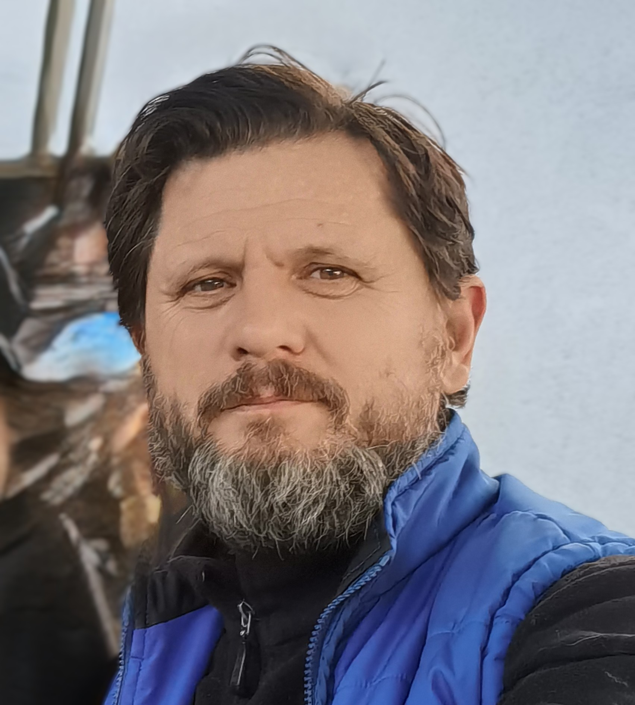

# **Witaj w moim portfolio** 

### Data Scientist | AI Developer | ML Engineer 

Moja przygoda z programowaniem rozpoczęła się od Arduino i mikrokontrolerów, co stanowiło moje hobby. W pracy miałem styczność z analizą danych przy użyciu Excela. Dynamiczny rozwój sztucznej inteligencji i jej dostępność w wielu narzędziach otworzyły przede mną nowe możliwości, które postanowiłem wykorzystać. Na początku roku 2025 zapisałem się na kurs "Od zera do AI", co zapoczątkowało moją poważniejszą przygodę z Data Science i AI. Po kilku miesiącach nauki dołączyłem do grupy Masterclass, gdzie intensywnie podnoszę swoje kwalifikacje i zdobywam praktyczne doświadczenie w obszarze analizy danych i sztucznej inteligencji.      
Hobbystyczne pisanie użytecznych aplikacji to zajęcie, które łączy w sobie pasję do programowania z chęcią tworzenia narzędzi, które realnie ułatwiają życie. Praca nad takimi projektami stanowi dla mnie nie tylko formę relaksu i samorealizacji, ale również sposób na rozwijanie swoich umiejętności.
Wspomniane aplikacje często powstają w odpowiedzi na konkretne potrzeby, zauważone w codziennym życiu.

### W panelu bocznym znajdziesz    
**Projekty z kursu** - projekty zaliczeniowe, dodatkowo rozbudowane i dopracowane wizualnie     
**Obecne projekty** - wspólne projekty tworzone w grupie Masterclass       
**Po godzinach** - przykłady projektów które tworzę z pasji.

## **O Mnie**
🎓 Wykształcenie   
Mechanik Automatyki Przemysłowej i Urządzeń Precyzyjnych    
📜 Certyfikaty    
Kurs Data Science (w trakcie)    
💼 Doświadczenie    
- ok. 15 lat doświadczenia w handlu głównie w branży AGD    
- ok. 15 lat doświadczenia w serwisie AGD, w tym 4 lata kierowania serwisem fabrycznym dużej marki   
- 7 miesięcy intensywnej nauki na kursie Data Science/AI    
- członkostwo w elitarnej grupie Masterclass - rozszerzenie kursu    

## **Umiejętności Techniczne**
🐍 Języki programowania
Python 

### ⚛️ Frameworki i biblioteki
Streamlit | React (w trakcie) | Pandas | NumPy | Plotly   

### 🤖 AI/ML
OpenAI | Ollama | PyCaret | Scikit-learn

### 🗄️ Bazy danych
PostgreSQL | Supabase | Qdrant

### ☁️ Cloud & DevOps
AWS S3 | Digital Ocean | Supabase | Redis | Netlify

### 🔧 Inne narzędzia
MCP | GitHub | Langfuse

## **Kontakt**
Kliknij    
📧 Email: <a href="mailto:jacap30@gmail.com?subject=Kontakt%20z%20portfolio&body=Witaj%20Jacek!" data-tooltip="Kliknij, aby otworzyć klienta pocztowego i wysłać wiadomość">jacap30@gmail.com</a>    
📱 Tel <--    
<a href="https://github.com/JacaP30?tab=repositories" data-tooltip="Zobacz moje repozytoria na GitHub">📂 GitHub --&gt;</a>   
<a href="https://www.linkedin.com/in/jacek-przybylak-5883132a7/" data-tooltip="Odwiedź mnie na LinkedIn">💼 41LinkedIn --&gt;</a>     
