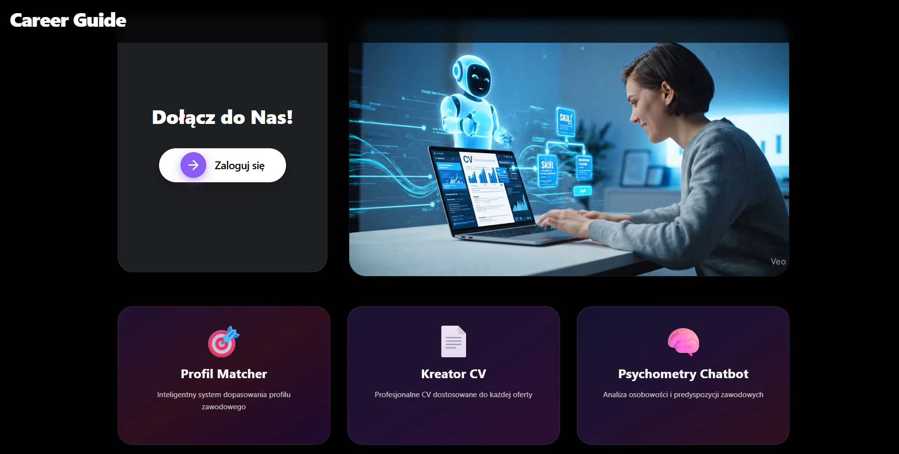
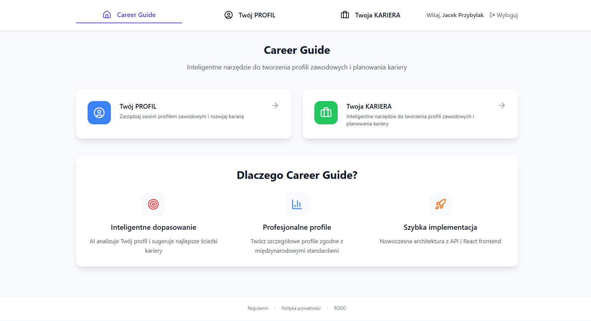
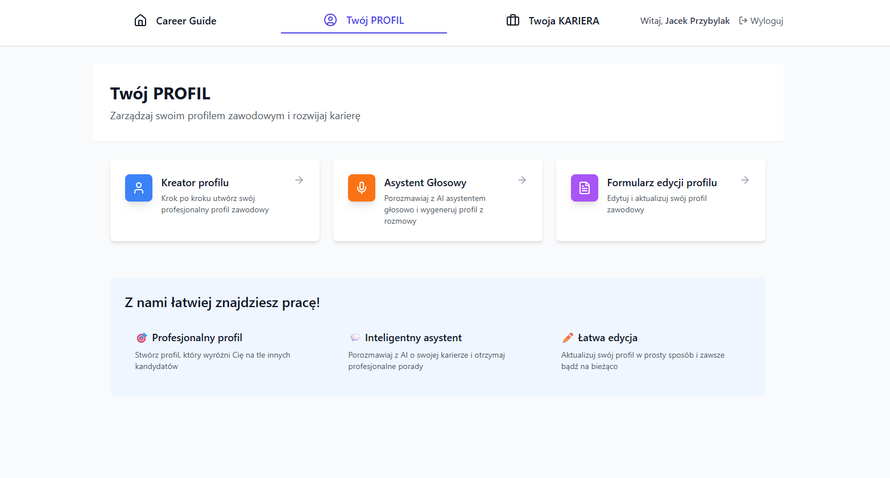
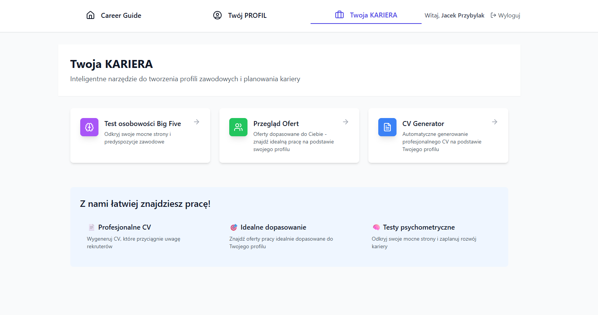

# **Career Guide - inteligentna aplikacja do zarządzania poszukiwaniem pracy**

Funkcjonowanie w dużej mierze opiera się na ML i AI    
Wraz z zespołem budujemy system, który wspiera cały cykl życia kandydata: od diagnozy kompetencji, przez dopasowanie do ofert pracy, aż po rozwój i przygotowanie do rozmów. Aplikacja składa się z kilku współpracujących modułów:   
🔹 Profil zawodowy (FastAPI + Supabase)
Zbiera dane o doświadczeniu, umiejętnościach, edukacji i celach kandydata.    
🔹 Matching & Analiza ofert
Silnik dopasowań łączy kandydatów z ofertami pracy.   
🔹 egzAIminator – Twój trener AI
Tworzy spersonalizowane egzaminy techniczne na bazie profilu, generuje pytania, waliduje odpowiedzi i przygotowuje feedback.
Zawiera podsumowanie wyników z rekomendacjami rozwojowymi.   
🔹 Tworzenie CV 
Interaktywny edytor CV z generatorami treści oraz podglądem na żywo.
Integracja ze zgromadzonymi danymi profilu.   
🔹 Zarządzanie zasobami & zespołami
Moduł do pracy HR — przegląd statusu kandydatów, zespołów, projektów i zgód RODO.
Wsparcie dla dashboardów technicznych i analityki.   
🔹 Asystent głosowy
Tryb voice-first dla kandydatów.
Tworzy profil na podstawie rozmowy i umożliwia naturalną interakcję.    
      
Zdjęcia z pierwszej wersji.

