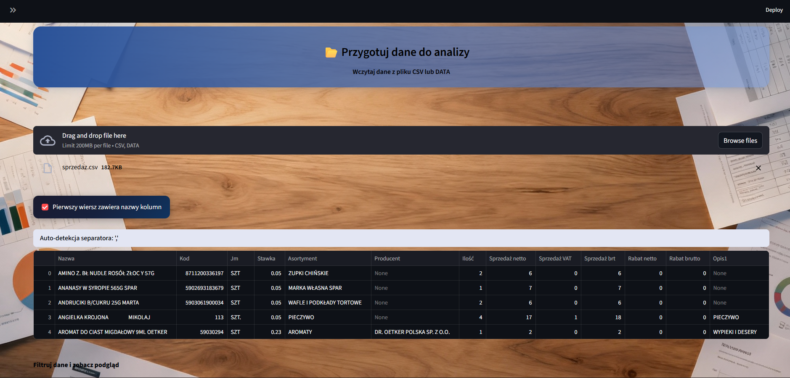
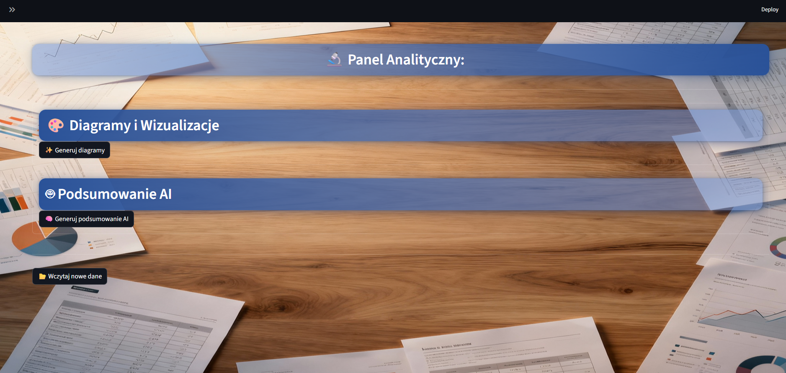

# Insightly — ML i AI {: .portfolio-title }

Analizy danych sprzedażowych i estymacje zamówień z wykorzystaniem ML i AI. Aplikacja w fazie projektu — poniżej zrzuty z pierwszej wersji nieprodukcyjnej.

## Zrzuty ekranu

## Technologie

Python
ML
AI
Analiza danych

