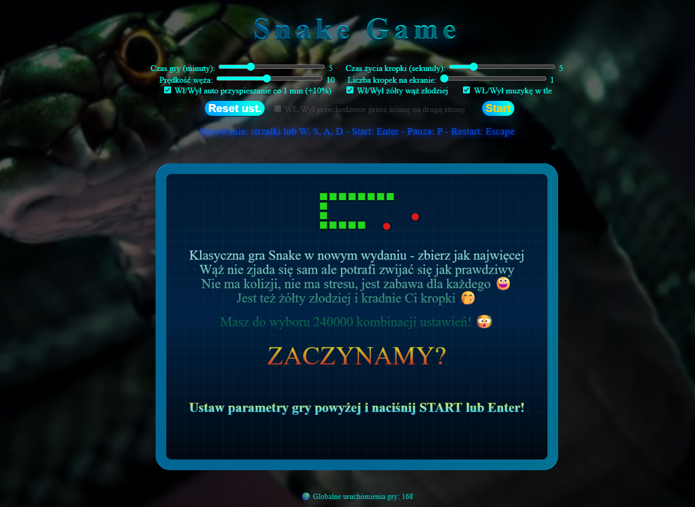
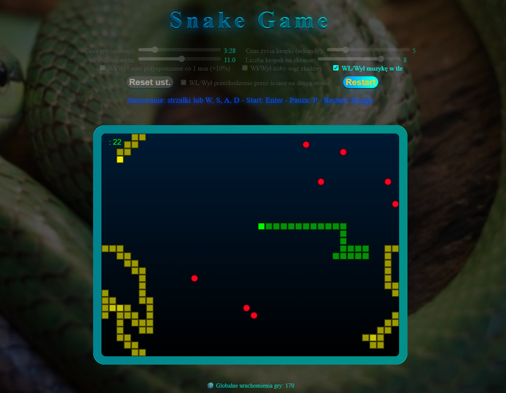

# **Popularna gra komputerowa SNAKE**
Aplikacja napisana dla zabawy bo syn przypomniał sobie że grał w "jakiegoś węża" kiedy był mały.
Tak powstała nowa odsłona znanej gry Snake. Dzięki dużej liczbie ustawień zagra maluch jak i mistrz szybkości. 
 

*Klinięcie obrazu otworzy aplikację*

## ✨**Funkcjonalność**   
✅ Rozgrywka w pojedynkę lub z przeszkadzającym wężem złodziejem    
✅ Czas gry od 1 do 15 min    
✅ Prędkość poruszania ustawiana od 1 do 20  z aut przyspieszeniem lub bez    
✅  Czas życia kropki od 1 do 20 s     
✅  Liczba kropek na ekranie jednocześnie od 1 do 10    
✅  W trybie bez złodzieja możliwość wyłączenia pojawiania się,   
   po drugiej stronie przechodząc przez ścianę.    
✅  Globalny licznik zliczający uruchomienia

## 💻 **Wykorzystane technologie i biblioteki**

TypeScript | JavaScript  | HTML5 | CSS | Github | JSON | npm 