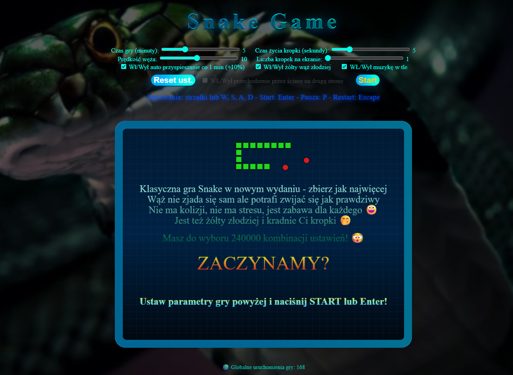
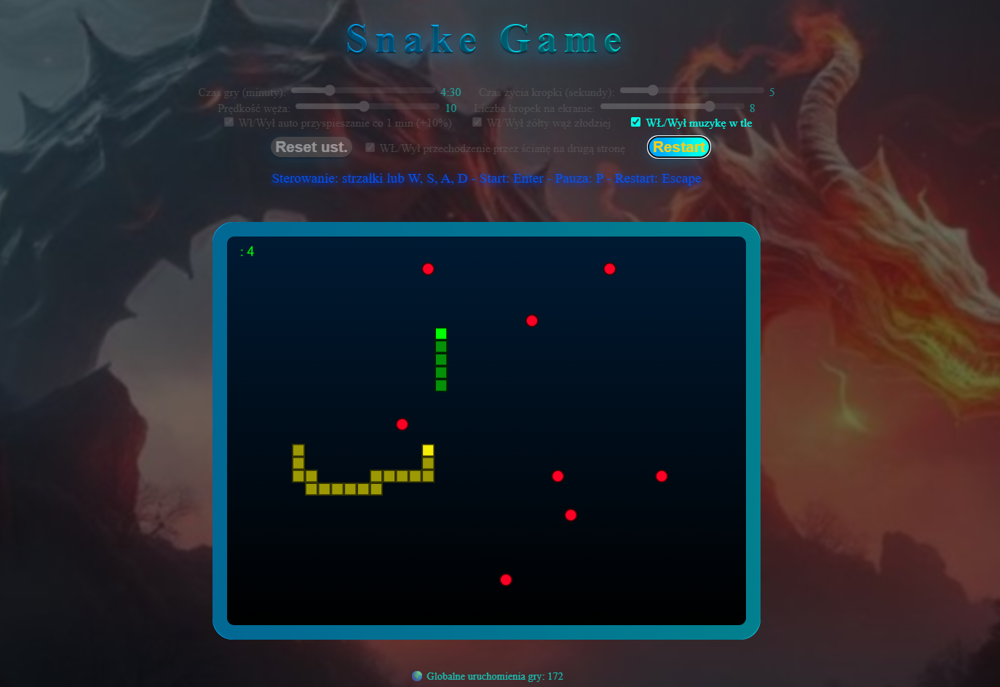
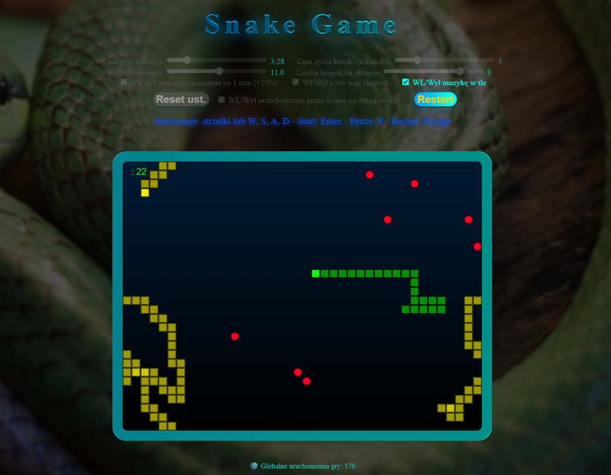

# Popularna gra komputerowa SNAKE {: .portfolio-title }

Aplikacja napisana dla zabawy — syn przypomniał sobie, że grał w „jakiegoś węża", kiedy był mały. Tak powstała nowa odsłona znanej gry Snake. Dzięki dużej liczbie ustawień zagra maluch jak i mistrz szybkości.

## Zrzuty ekranu

Kliknięcie obrazu otworzy aplikację.

## Funkcjonalność

- Rozgrywka w pojedynkę lub z przeszkadzającym wężem złodziejem
- Czas gry od 1 do 15 min
- Prędkość poruszania ustawiana od 1 do 20 z autoprzyspieszeniem lub bez
- Czas życia kropki od 1 do 20 s
- Liczba kropek na ekranie jednocześnie od 1 do 10
- W trybie bez złodzieja możliwość wyłączenia pojawiania się po drugiej stronie przy przechodzeniu przez ścianę
- Globalny licznik zliczający uruchomienia

## Technologie

TypeScript
JavaScript
HTML5
CSS
npm
Netlify
GitHub

