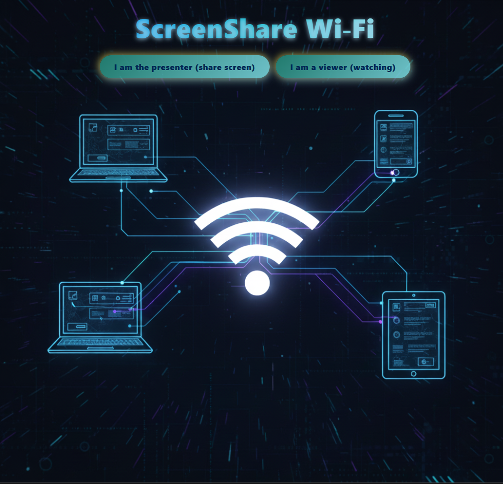

# **Wyświetlacz Wi-Fi**
Aplikacja umożliwia udostępnienie ekranu z jednego urządzenia i oglądanie go na innych urządzeniach w tej samej sieci Wi-Fi. Nie wymaga do tego instalowania żadnych aplikacji u odbiorców - wystarczy przeglądarka.    
Pomysł powstał podczas wspólnej biesiady, kiedy każdy znajdował inny tekst tej samej piosenki na swoim urządzeniu.     
Świetnie sprawdza się kiedy potrzebny jest dodatkowy monitor jak również jako niania przy śpiącym dziecku przesyłając obraz i dźwięk z okna kamery.

## ✨ **Funkcjonalność**    
✅ Automatyczne wykrywanie sieci Wi-Fi (Windows/macOS/Linux)   
✅ Automatyczne wykrywanie IP serwera   
✅ Wprowadzenia hasła sieci Wi-Fi przez nadawcę, generowane w kodzie jeśli wymagane   
✅ Generowanie kodów QR z danymi (sieć Wi-Fi + aplikacja)   
✅ Automatyczne otwieranie przeglądarki po uruchomieniu   
✅ Udostępnienie jednej karty, okna, lub całego ekranu    
✅ W tej samej chwili w sieci może działać kilku nadawców a odbiorcy mogą wybrać dowolnie

## 💻 **Wykorzystane technologie i biblioteki**

JavaScript  | HTML5 | CSS | HTTP | WebRTC | WebSocket (ws) | MediaDevices API | Node | Express | WebSocket (ws) | QR Code | Child Process | OS | Path | CryptoGithub | JSON | npm |nodemon | pkg 

