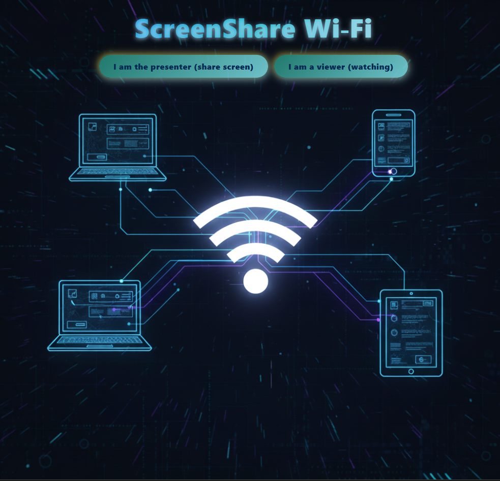
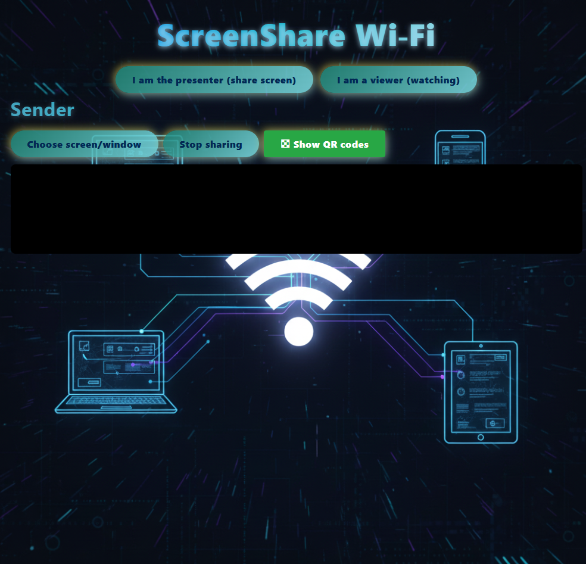
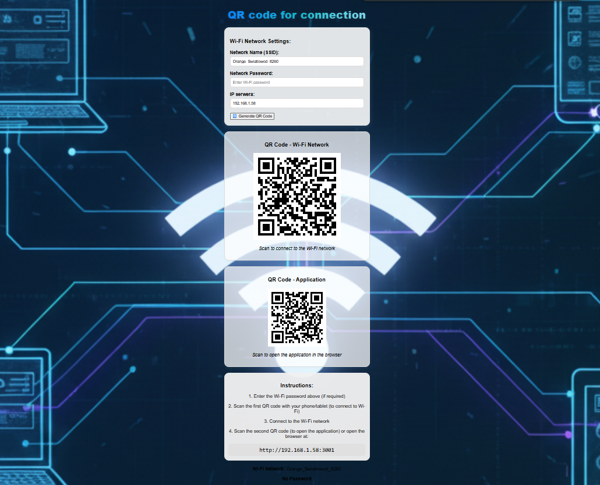

# Wyświetlacz Wi-Fi {: .portfolio-title }

Aplikacja umożliwia udostępnienie ekranu z jednego urządzenia i oglądanie go na innych urządzeniach w tej samej sieci Wi-Fi. Nie wymaga instalowania żadnych aplikacji u odbiorców — wystarczy przeglądarka. Pomysł powstał podczas wspólnej biesiady, kiedy każdy znajdował inny tekst tej samej piosenki na swoim urządzeniu.

## Zrzuty ekranu

## Funkcjonalność

- Automatyczne wykrywanie sieci Wi-Fi (Windows / macOS / Linux)
- Automatyczne wykrywanie IP serwera
- Wprowadzanie hasła sieci Wi-Fi przez nadawcę, generowane w kodzie jeśli wymagane
- Generowanie kodów QR z danymi (sieć Wi-Fi + aplikacja)
- Automatyczne otwieranie przeglądarki po uruchomieniu
- Udostępnienie jednej karty, okna lub całego ekranu
- W tej samej chwili w sieci może działać kilku nadawców, a odbiorcy mogą wybrać dowolnie

## Technologie

JavaScript
HTML5
CSS
Node.js
Express
WebRTC
WebSocket
MediaDevices API
QR Code
npm
GitHub

