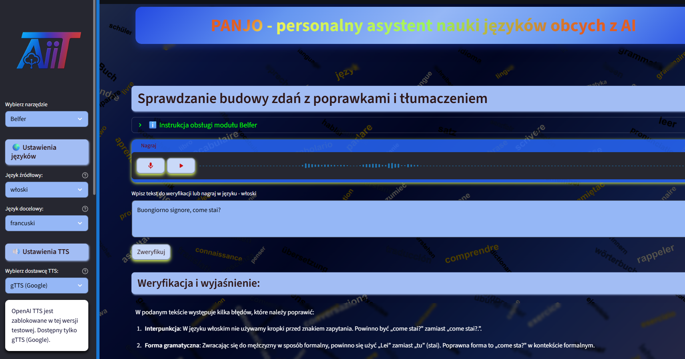

# **PANJO - personalny asystent nauki języków obcych z AI**
Aplikacja wspiera naukę języków obcych. Do działania wykorzystuje nowoczesny stack technologiczny z naciskiem na integrację z OpenAI API, zapewniając zaawansowane funkcje edukacyjne przy zachowaniu prostoty interfejsu użytkownika.

*Klinięcie obrazu otworzy aplikację wykonaną w Streamlit*

## ✨ **Funkcjonalności**

### 🎓 **Nauka słówek**
- Inteligentny system fiszek z algorytmem powtórek
- Gotowe zestawy słówek tematycznych
- Dodawanie własnych słówek i list
- System poziomów trudności (podstawowy/średni/zaawansowany)
- Testy wiedzy i statystyki postępów
- Funkcja powtórki trudniejszych słówek

### 👨‍🏫 **Belfer**
- Analiza poprawności gramatycznej i składniowej
- Sprawdzanie pisowni i budowy zdań
- Szczegółowe wyjaśnienia błędów z poprawkami
- Tłumaczenie tekstu na język docelowy
- Synteza mowy dla wyjaśnień

### 💬 **Dialog z AI**
- Naturalne rozmowy z AI w wybranym języku
- Ciągła historia konwersacji
- Nagrywanie i rozpoznawanie mowy
- Synteza mowy dla odpowiedzi AI
- Różne tematy rozmów

### 🌍 **Translator**
- Tłumaczenie tekstu między obsługiwanymi językami
- Rozpoznawanie mowy (nagrywanie wypowiedzi)
- Synteza mowy dla tłumaczeń
- Obsługa wielu par językowych

## 🌐 **Obsługiwane języki**

- 🇵🇱 Polski
- 🇬🇧 Angielski  
- 🇩🇪 Niemiecki
- 🇫🇷 Francuski
- 🇪🇸 Hiszpański
- 🇮🇹 Włoski

## 💡 **Innowacje**    
Zintegrowany system śledzenia kosztów API

## 💻 **Wykorzystane technologie i biblioteki**

Python | Streamlit | Openai | Github | sounddevice | scipy | JSON | CSS custom | HTML 

#### 🤖 **Modele AI OpenAI**   
- GPT-4o-mini - główny model do analizy tekstu, tłumaczeń i dialogów   
- Whisper-1 - rozpoznawanie mowy z nagrań audio    
- TTS-1 - synteza mowy z różnymi głosami dla różnych języków      
(w wersji podstawowej gTTS Google)