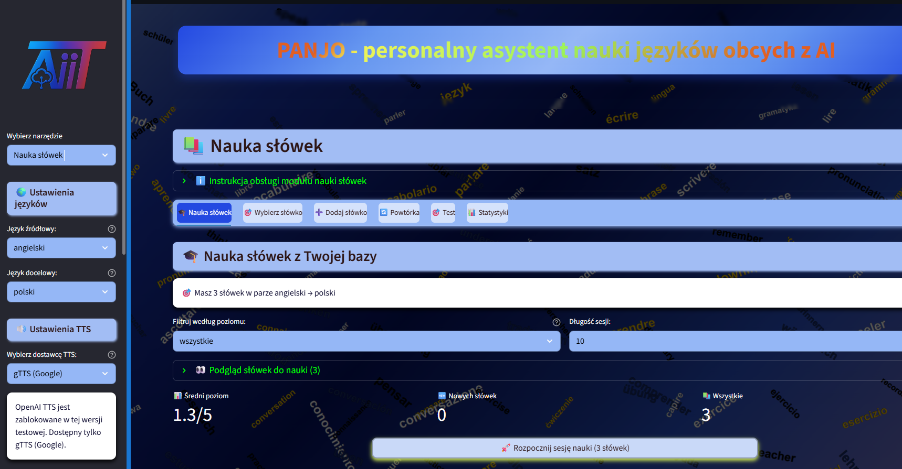
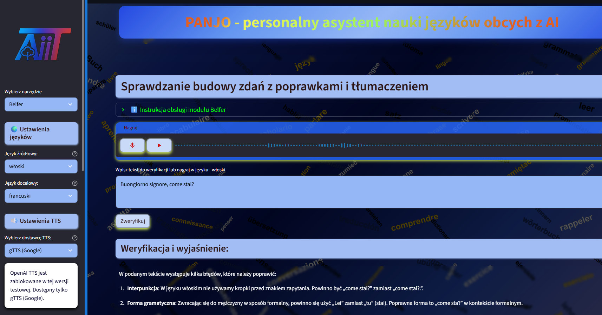
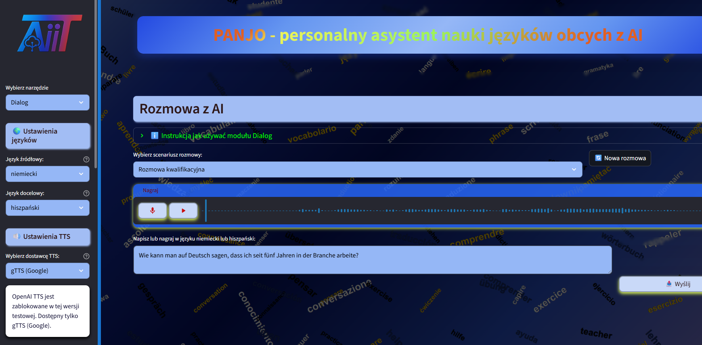
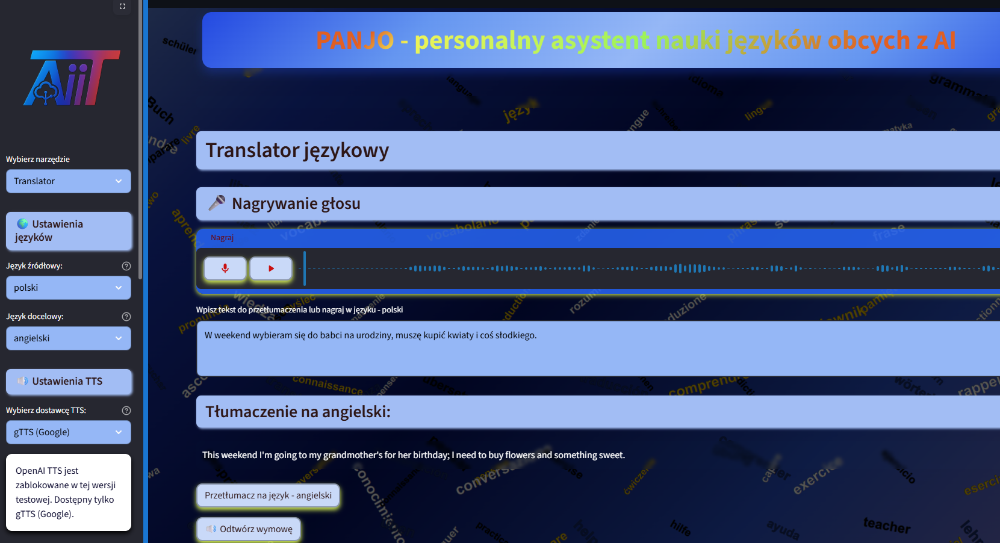

# PANJO — personalny asystent nauki języków obcych z AI {: .portfolio-title }

Aplikacja wspiera naukę języków obcych. Do działania wykorzystuje nowoczesny stack technologiczny z naciskiem na integrację z OpenAI API, zapewniając zaawansowane funkcje edukacyjne przy zachowaniu prostoty interfejsu użytkownika.

<a href="https://panjozai.streamlit.app/" class="md-button md-button--primary" target="_blank" rel="noopener noreferrer">Otwórz demo</a>

## Zrzuty ekranu

Kliknięcie obrazu otworzy aplikację w Streamlit.

## Funkcjonalności

### Nauka słówek

- Inteligentny system fiszek z algorytmem powtórek
- Gotowe zestawy słówek tematycznych
- Dodawanie własnych słówek i list
- System poziomów trudności (podstawowy / średni / zaawansowany)
- Testy wiedzy i statystyki postępów
- Funkcja powtórki trudniejszych słówek

### Belfer

- Analiza poprawności gramatycznej i składniowej
- Sprawdzanie pisowni i budowy zdań
- Szczegółowe wyjaśnienia błędów z poprawkami
- Tłumaczenie tekstu na język docelowy
- Synteza mowy dla wyjaśnień

### Dialog z AI

- Naturalne rozmowy z AI w wybranym języku
- Ciągła historia konwersacji
- Nagrywanie i rozpoznawanie mowy
- Synteza mowy dla odpowiedzi AI
- Różne tematy rozmów

### Translator

- Tłumaczenie tekstu między obsługiwanymi językami
- Rozpoznawanie mowy (nagrywanie wypowiedzi)
- Synteza mowy dla tłumaczeń
- Obsługa wielu par językowych

## Obsługiwane języki

Polski · Angielski · Niemiecki · Francuski · Hiszpański · Włoski

## Innowacje

Zintegrowany system śledzenia kosztów API.

## Technologie

Python
Streamlit
OpenAI
GPT-4o-mini
Whisper-1
TTS-1
GitHub
sounddevice
scipy

