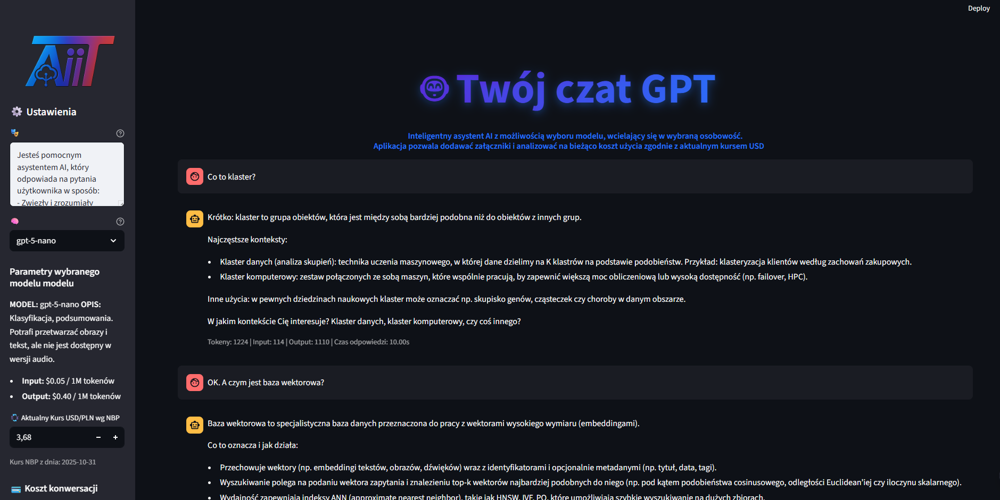
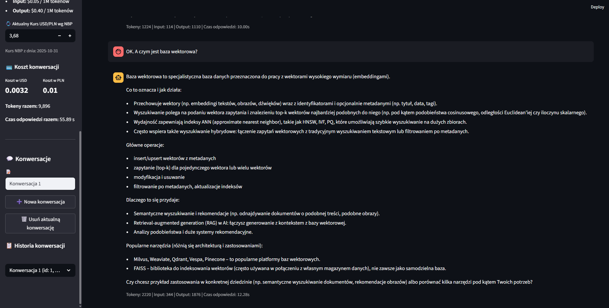

# Twój czat GPT {: .portfolio-title }

Aplikacja typu czat z opcją nadania osobowości dla wybranego modelu, umożliwiająca śledzenie tokenów i kosztów bezpośrednio w aplikacji. Prompty i metryki zapisywane są również na platformie Langfuse.

## Zrzuty ekranu

Kliknięcie obrazu otworzy aplikację. Wersja demo posiada ograniczenie tokenów dla odpowiedzi.

## Funkcje

- Testowanie modeli GPT-5
- Nadanie osobowości dla wybranego modelu
- Śledzenie użycia tokenów w dialogu
- Podsumowanie tokenów w bocznym panelu
- Podsumowanie kosztu konwersji w USD i PLN według aktualnego kursu
- Historia konwersacji

## Technologie

Python
Streamlit
OpenAI
Langfuse
PyPDF2
python-docx
Scikit-learn
GitHub

