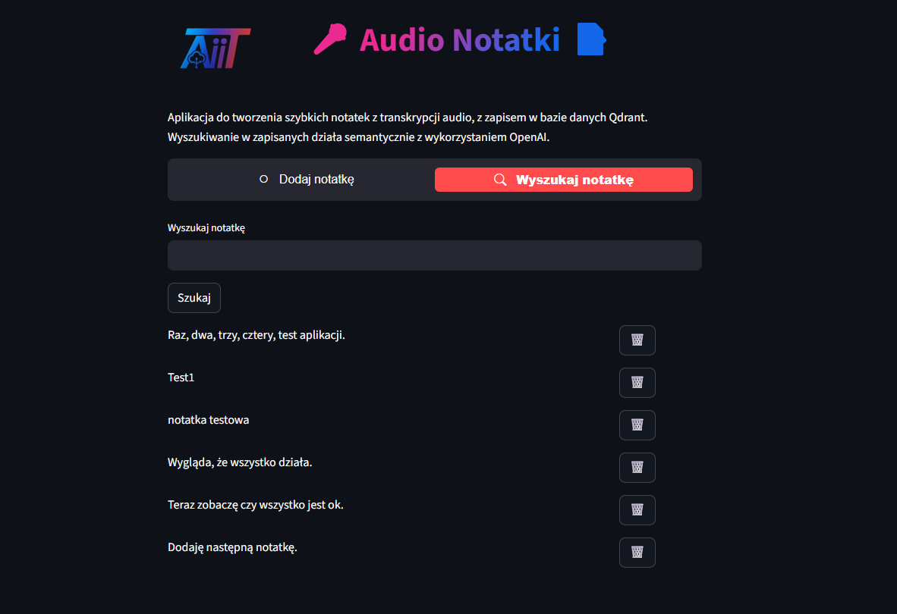

# Audio Notatki z Qdrant i AI {: .portfolio-title }

Audio Notatki to lekka aplikacja webowa opierająca swoje działanie na modelu AI Whisper i bazie wektorowej Qdrant.

<a href="https://notatkiaudiojp.streamlit.app/" class="md-button md-button--primary" target="_blank" rel="noopener noreferrer">Otwórz demo</a>

## Zrzuty ekranu

Kliknięcie obrazu otworzy aplikację w Streamlit.

## Funkcje

- Nagrywanie audio w przeglądarce, transkrypcja (OpenAI Whisper)
- Edycja treści przed zapisem
- Zapis do bazy Qdrant z embeddingami (OpenAI `text-embedding-3-large`)
- Wyszukiwanie semantyczne w notatkach
- Usuwanie zbędnych notatek

## Technologie

Python
Streamlit
OpenAI
Qdrant
Pydub
Scikit-learn
GitHub

