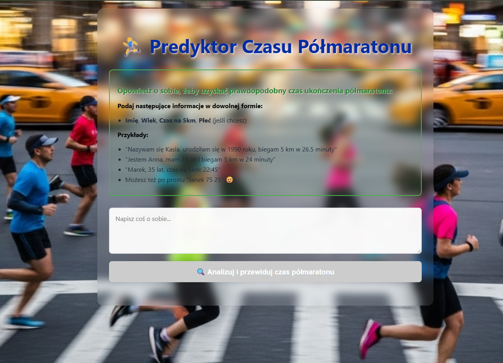
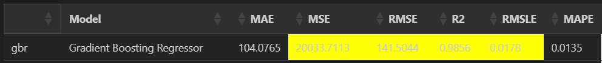

# **Predyktor Czasu Półmaratonu AI**
Aplikacja opiera swoje działanie na modelu regresyjnym do przewidywania prawdopodobnego czasu ukończenia Półmaratonu Wrocławskiego, wytrenowanym na bazie danych z roku 2023 i 2024, umieszczonych na Digital Ocean. LLM wyłuskuje z opisu potrzebne informacje do predykcji a jego metryki zapisywane są do bazy Langfuse. 

*Kliknięcie obrazu otworzy aplikację wykonaną w Streamlit*

**Kliknięcie obrazu otworzy aplikację wykonaną w React**    
  

## ✨ **Funkcjonalność**     
 - w polu tekstowym, użytkownik się przedstawia, podaje płeć, wiek i tempo na 5km     
 - jeśli użytkownik podał za mało danych, wyświetla informację o tym jakich danych brakuje     
 - za pomocą LLM (OpenAI) wyłuskuje dane, potrzebne dla modelu ML   
 - wyświetla prawdopodobny czas ukończenia maratonu z wysoką dokładnością (R2 0.9856)   
 - zbiera metryki o skuteczności działania LLM'a w Langfuse     

## 🤖 Metryki wytrenowanego modelu

## 📓 Notebook    
<a href="trenowanie_modelu.ipynb" class="md-button md-button--primary" data-tooltip="Pobierz plik Jupyter Notebook z pełną analizą danych irysów">Notebook</a>

## 💻 **Wykorzystane technologie i biblioteki**

Python | Streamlit / React | CSS custom | HTML | Openai | Langfuse | Github | Scikit-learn | PyCaret | JSON | Pandas | Numpy | Boto3 | Python-dotenv | Base64  | Datetime | Digital Ocean | Jupyter Notebook | Excalidraw   
