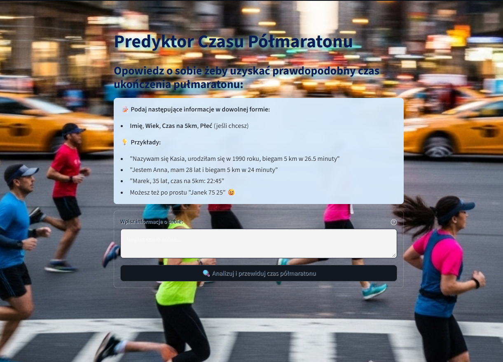
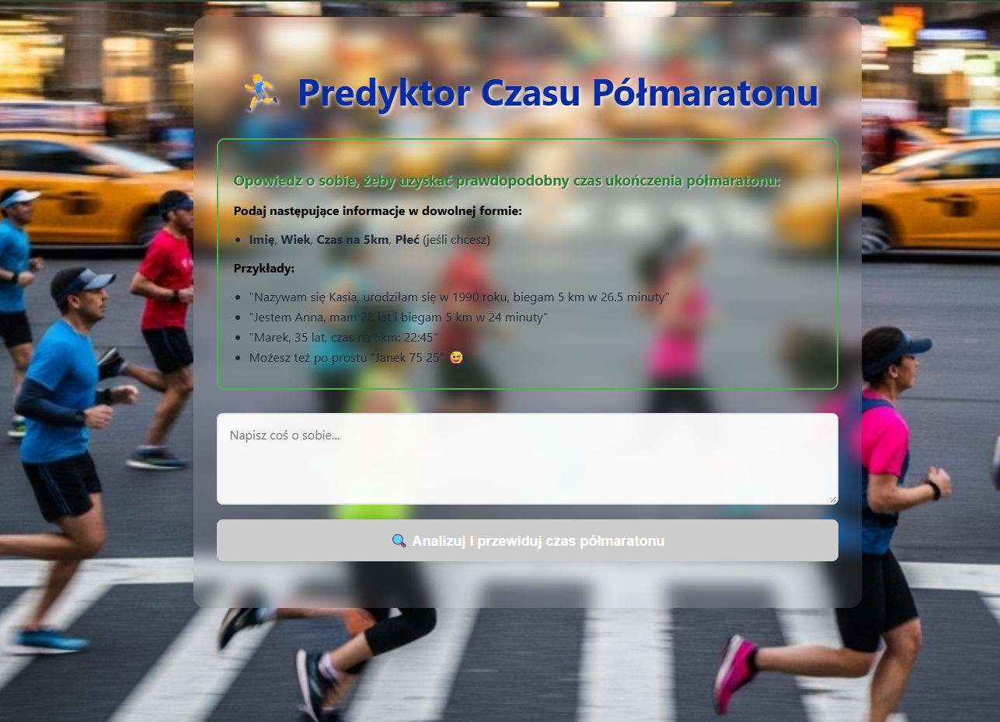
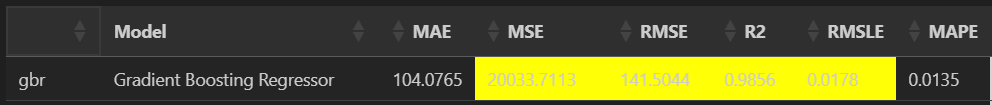

# Predyktor Czasu Półmaratonu AI {: .portfolio-title }

Aplikacja opiera swoje działanie na modelu regresyjnym do przewidywania prawdopodobnego czasu ukończenia Półmaratonu Wrocławskiego, wytrenowanym na bazie danych z lat 2023 i 2024 na Digital Ocean. LLM wyłuskuje z opisu potrzebne informacje do predykcji, a metryki zapisywane są do bazy Langfuse.

<a href="https://predyktor-czasu-pulmaratonu.streamlit.app/" class="md-button md-button--primary" target="_blank" rel="noopener noreferrer">Demo — Streamlit</a>
<a href="https://predyktor.netlify.app/" class="md-button" target="_blank" rel="noopener noreferrer">Demo — React</a>
<a href="trenowanie_modelu.ipynb" class="md-button" data-tooltip="Pobierz notebook z trenowaniem modelu">Notebook</a>

## Zrzuty ekranu

Kliknięcie obrazu otworzy aplikację.

## Funkcjonalność

- W polu tekstowym użytkownik się przedstawia, podaje płeć, wiek i tempo na 5 km
- Jeśli użytkownik podał za mało danych, wyświetla informację o tym, jakich danych brakuje
- Za pomocą LLM (OpenAI) wyłuskuje dane potrzebne dla modelu ML
- Wyświetla prawdopodobny czas ukończenia maratonu z wysoką dokładnością (R² 0.9856)
- Zbiera metryki o skuteczności działania LLM w Langfuse

## Metryki wytrenowanego modelu

## Technologie

Python
Streamlit
React
OpenAI
Langfuse
Scikit-learn
PyCaret
Pandas
NumPy
Boto3
Digital Ocean
Jupyter Notebook
GitHub

