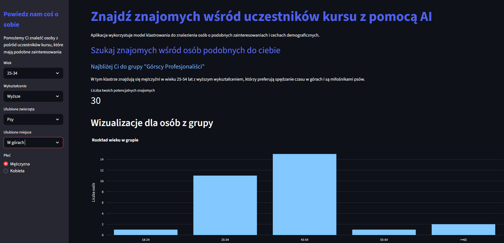

# Znajdź znajomych wśród uczestników kursu z pomocą AI {: .portfolio-title }

Aplikacja używa modelu klastrowania do znalezienia „bratniej duszy" wśród uczestników kursu.

## Zrzuty ekranu

Kliknięcie obrazu otworzy aplikację.

## Funkcjonalność

Wybierając przedział wiekowy, wykształcenie, ulubione zwierzęta i miejsca oraz płeć, model klastrowania wytrenowany na danych z ankiety przypisze Cię do grupy podobnych osób i wyświetli krótki opis.

## Technologie

Python
Streamlit
PyCaret
Pandas
Plotly
Clustering
GitHub

